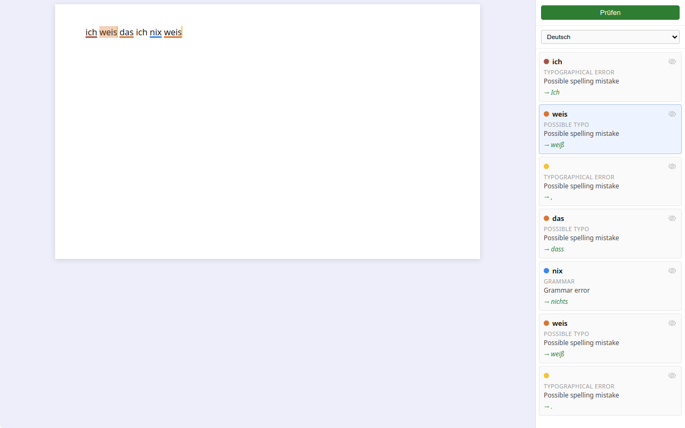

# Local AI Spellcheck Server

Lokaler Rechtschreib- und Grammatikserver als Drop-in-Ersatz für LanguageTool.
Läuft komplett offline mit GGUF-Modellen über llama.cpp — kein Cloud-Zugang nötig.

## Funktionsweise

- Startet einen Express-Server auf Port **9099** (LanguageTool-kompatibles API)
- Lädt beim Start ein GGUF-Modell einmalig über `llama-server` (Port 8081 intern)
- Nutzt GPU-Offloading via **Vulkan** (AMD/NVIDIA) — Modell bleibt dauerhaft im Speicher
- Vergleicht Original- und korrigierten Text mit einem LCS-Diff und gibt Fehler mit Offsets zurück

---

## Voraussetzungen

- Node.js
- llama.cpp gebaut mit Vulkan-Support (siehe unten)
- Ein GGUF-Modell im Ordner `models/`

---

## Modelle

Modelle als `.gguf`-Datei in den Ordner `models/` legen.
Aktives Modell in `config.js` über `SELECTED_MODEL_ID` auswählen.

| ID | Dateiname | Größe | Geschwindigkeit | Qualität | Download |
|----|-----------|-------|-----------------|----------|---------|
| 1 | `rwkv7-2.9B-g1-q4_k_m.gguf` | 1.9 GB | < 10 s | befriedigend (de/en/fr) | [shoumenchougou/RWKV7-G1d-2.9B-GGUF](https://huggingface.co/shoumenchougou/RWKV7-G1d-2.9B-GGUF/blob/main/rwkv7-g1d-2.9b-Q4_K_M.gguf) |
| 2 | `Mistral-Nemo-Instruct-2407-Q6_K.gguf` | 9.4 GB | ~30 s | gut | [bartowski/Mistral-Nemo-Instruct-2407-GGUF](https://huggingface.co/bartowski/Mistral-Nemo-Instruct-2407-GGUF/blob/main/Mistral-Nemo-Instruct-2407-Q6_K.gguf) |
| 3 | `Qwen2.5-7B-Instruct-Q6_K.gguf` | 5.8 GB | < 10 s | gut, passt komplett in 8 GB VRAM ✅ | [bartowski/Qwen2.5-7B-Instruct-GGUF](https://huggingface.co/bartowski/Qwen2.5-7B-Instruct-GGUF/blob/main/Qwen2.5-7B-Instruct-Q6_K.gguf) |

> **Empfehlung:** Modell 3 (Qwen2.5-7B) bei GPU mit ≥ 6 GB VRAM.

---

## llama.cpp mit Vulkan bauen

Nur einmalig nötig. Danach liegen die Binaries in `llama.cpp/build/bin/`.

```bash
cd llama.cpp
cmake -B build -DGGML_VULKAN=ON -DCMAKE_BUILD_TYPE=Release
cmake --build build --target llama-server -j$(nproc)
```

Vulkan muss auf dem System installiert sein (`vulkaninfo` zum Prüfen).
Für AMD: `libvulkan_radeon`, für NVIDIA: `libvulkan_nvidia` / CUDA-Build.

---

## Server starten

```bash
node spellcheck-server.js
```
oder
```bash
npm start
```


Beim ersten Start wird das Modell geladen — das dauert je nach Größe 5–60 Sekunden.
Danach ist der Server bereit und bleibt bis zum Beenden geladen.

---

## Test-Request

```bash
curl -X POST http://localhost:9099/v2/check \
  -H "Content-Type: application/json" \
  -d '{"text":"Das ist einn Test mit Fehlern. Und dies ist ein anderer Satz der auch einen Fehla hat.", "language":"de-DE"}'
```

Mit optionalen Prüfungs-Headern:

```bash
curl -X POST http://localhost:9099/v2/check \
  -H "Content-Type: application/json" \
  -H "X-Exam-Name: Mathe-Schularbeit" \
  -H "X-Student-Name: Max Mustermann" \
  -H "X-Exam-Pin: 1234" \
  -d '{"text":"Das ist einn Test mit Fehlern.", "language":"de-DE"}'
```

Unterstützte Sprachen: `de-DE`, `de-AT`, `de-CH`, `en-US`, `en-GB`, `it-IT`, `fr-FR`, `fr-CH`

---

## Klartext — Test-Editor

Im Unterordner `LT/` befindet sich **Klartext**, ein Electron-basierter Editor zum direkten Testen des Servers.
Er zeigt Fehler farbkodiert als Unterstreichungen im Text und listet sie in einer Seitenleiste auf.

```bash
cd LT
npm install   # einmalig
npm run dev
```

Oder direkt aus dem Projektroot:

```bash
npm run klartext
```

> Der Spellcheck-Server muss laufen (`npm start` im Projektroot), bevor der Editor geöffnet wird.



---

## Projektstruktur

```
spellcheck-server.js   — Express-Server, Route, Startup
config.js              — Modelle, Ports, Pfade (hier SELECTED_MODEL_ID ändern)
llm-server.js          — llama-server starten/stoppen
inference.js           — Prompt aufbauen, HTTP-Call, Rohtext bereinigen
diff.js                — Word-Diff (LCS), Whitespace-Check, LT-Response bauen
LT/                    — Klartext Test-Editor (Electron + Vue)
models/                — GGUF-Modelldateien (nicht im Git)
llama.cpp/             — llama.cpp Quellcode + Build-Artefakte (nicht im Git)
```
